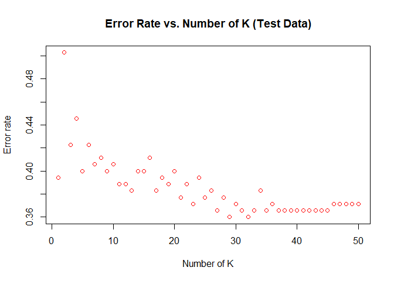

Bikesharing\_knnclassification
================

``` r
##############################################################################################################################################################
######################################################CitiBike KNN Classification#############################################################################
##This code uses K Nearest Neighbour Classification to predict whether the number of bike trips done in a day is below or above the average number of trips###
############Furthermore the code looks into change in prediction accuracy in training and test data with change in value of K(number of neighbours)###########

#libraries
library ('rgdal')
library ('car')
library ('corrplot')
library('ggpubr')
library('plotrix') 
library('FNN')
```

``` r
#Set working directory
setwd('C:/Users/spb65/Desktop/Applied Machine Learning')

##Read the data
test = read.csv('citibike_test.csv', header=TRUE)
train = read.csv('citibike_train.csv', header = TRUE)
weather = read.csv ('weather.csv', header = TRUE)

##Add a new column 'use' to determine whether that data is used for test or training
test$use = 'TEST'
train$use =  'TRAIN'

##Change the date column to datetime format
test$date = as.Date(test$date, format = '%m/%d/%y')
train$date = as.Date(train$date, format = '%m/%d/%y')
weather$date = as.Date (weather$date, format = '%m/%d/%y')

##Combine test and train data based on date
total = rbind(test, train)
total = merge(total, weather, by.x = c('date'), by.y = c('date'))


##Add a new column where 1 is greater than mean trips and rest is 0.Name the new column as tripsbi(Trips Binomial)
n = print (mean(total$trips))
```

    ## [1] 28141.06

``` r
total$tripsbi = 0
total$tripsbi[total$trips > n] = 1

##Drop all the categorical variables as Eucledian distance doesn't make sense for categorical variables.Also drop the original 'trips' column
total = subset(total, select = -c (date, holiday, month, dayofweek, trips))

##Drop NoData or equivalent rows
total = total  %>% dplyr::filter(total$AWND != -9999.0)

################################Divide training and test dataset again and standardize the data############################################################## 
test = subset (total, use == "TEST")
test.label = subset (test, select = c(tripsbi))

##Convert the label column to vector
test.label = test.label[, 1]
test = subset (test, select = -c(use, tripsbi, SNWD, SNOW))
test = base::scale(test)

train = subset (total, use == "TRAIN")
train.label = subset (train, select = c(tripsbi))
train.label = train.label[, 1]
train = subset (train, select = -c(use, tripsbi, SNWD, SNOW))
train = base::scale(train)
#############################################################################################################################################################
#############################################################################################################################################################
```

``` r
##Write function to calculate error rate of the KNN classifier##
#############Function Starts Here##############################
error_calc = function(classifier, label){k =0 
for (j in 1:length(classifier)){
  if (classifier[j]!=label[j])
    k = k+1
}
return(k/length(classifier))}
#############Function Ends Here################################
###############################################################
```

``` r
##Create a data frame with three 50 rows and three columns
error_rate = data.frame (matrix(ncol = 3, nrow=50))

##Conduct KNN classification with number of K ranging from 1 to 50 and check prediction accuracy for both training and test data
for (i in 1:50){

  classifier1 = knn(train, train, train.label, k = i, algorithm=c("kd_tree"))
  classifier2 = knn(train, test, train.label, k = i, algorithm=c("kd_tree"))
  
  ##Enter the error rates and number of k in the empty data frame by calling error_rate function
  error_rate$X1[i] = i
  error_rate$X2[i] = error_calc(classifier1, train.label)
  error_rate$X3[i] = error_calc(classifier2, test.label)
}
```

``` r
plot(error_rate$X1, error_rate$X2, col = 'blue', main = 'Error Rate vs. Number of K (Training Data)', xlab = 'Number of K', ylab = 'Error rate' )
```


``` r
plot(error_rate$X1, error_rate$X3, col = 'red',  main = 'Error Rate vs. Number of K (Test Data)', xlab = 'Number of K', ylab = 'Error rate' )
```

 

In the first plot, the error rate increases with the increase in the value of K, while in the second plot, the behaviour of error rate is somewhat reversed. The contrasting behaviour of the two plots depicts a phenomenon commonly referred to as overfitting. When K is low, the ML algorithm is able to learn the properties of each data point or small group of homogenous data points, and so the its prediction accuracy is high when tested on the same training dataset. However, the alogrithm cannot generalise well on a different data (Test dataset in this case). From prediction accuracy plot of test dataset, it's clear that the optimum value of K for this problem is around 30, even when the accuracy on the training data his high (error rate=0) at k =1.
